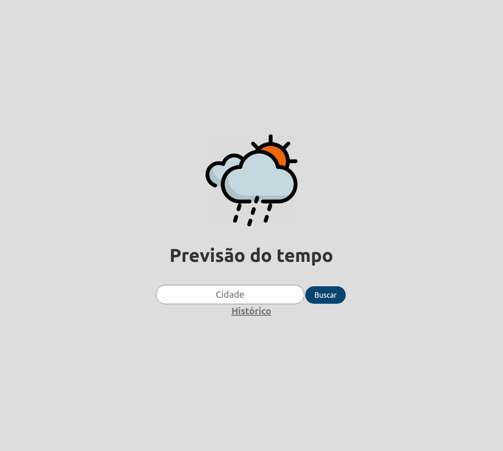
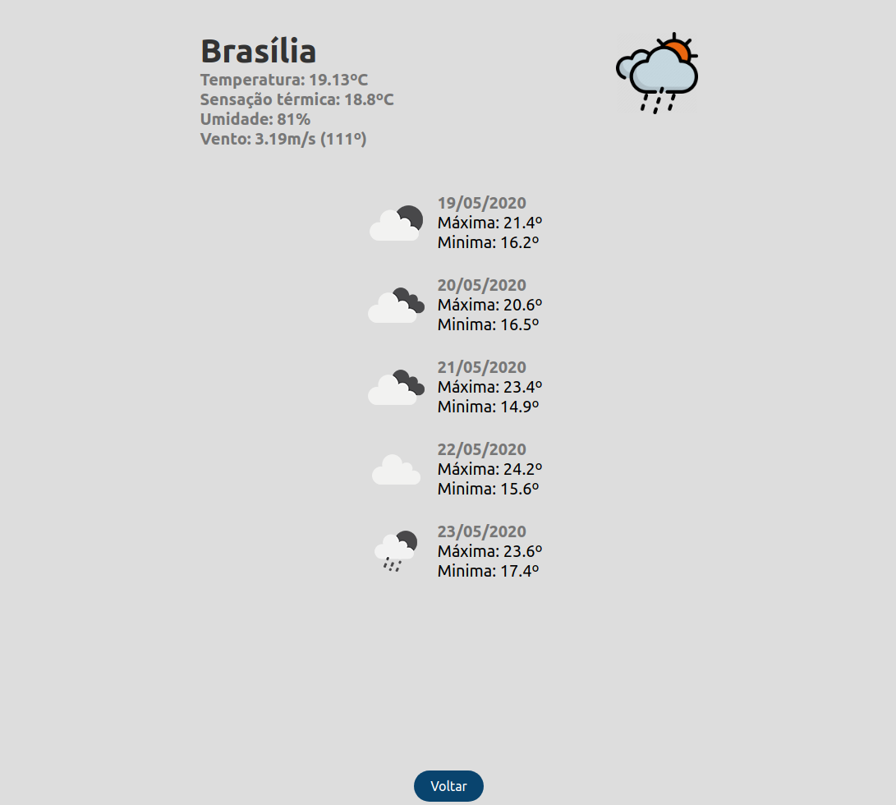

<p align="center">
   
</p>

# Previsão do Tempo

[](https://github.com/yagoernandes)
[](#)
[](https://github.com/yagoernandes/teste-linx/stargazers)
[](https://github.com/YagoErnandes/teste-linx/network/members)
[](https://github.com/YagoErnandes/teste-linx/graphs/contributors)

> Programa simples para visualizar previsão do tempo utilizando a API do [OpenWeatherMap](https://openweathermap.org/)

<p align="center"></p>
<p align="center"></p>

O programa é composto por 3 partes, Frontend em React(Node), Backend em Flask(Python) e um banco de dados Postgres, todas interligadas com docker e docker-compose.

Para levantar a aplicação completa pelo docker, basta executar:
```shell
docker-compose up
# ou
docker-compose up -d
```

## Frontend

O Frontend foi desenvolvido em Typescript utilizando as seguintes dependências:

```
react : Interface
redux : Gerenciador de estado global
redux-Saga : Gerenciador de efeitos secundários
styled-components : Componentes CSS
dotenv : Carregar variáveis de ambiente
chart.js : Gráficos
react-chartjs-2 : Encapsulamento do chart.js no react
axios : Consulta a API
```


Para desenvolvimento, além das tipagens padrões das bibliotecas, foi utilizado as seguintes dependências:

```
redux-devtools-extension : Comunicação entre a store do Redux e o Chrome devtools
eslint : Padrões de código
prettier : Formatação de código de acordo com os padrões
```

##### Para executar compilar a imagem Docker, execute:
```shell
docker build -t teste-yago-front ./front/
```

##### Para subir, execute:
```shell
docker run -p 80:80 -d teste-yago-front
```

##### Para executar localmente, execute:
```shell
npm install 

npm start --prefix front/
```

###### Configuração de conexão com o servidor:
* ./front/src/config/environments.ts


## Backend

O Backend foi construído usando a framework Flask.

##### Para subir, execute:
```shell
python ./api/api/run.py
```

###### Configuração de conexão com o banco:
* ./api/api/app/services/database.py


## Banco de dados

O banco possui um arquivo Dockerfile para gerar uma imagem de container docker com o banco já instalado e configurado.

##### Para compilar execute:
```shell
docker build -t teste-yago-db ./api/db/
```

##### Para subir, execute:
```shell
docker run -p 5432:5432 -d teste-yago-db
```
